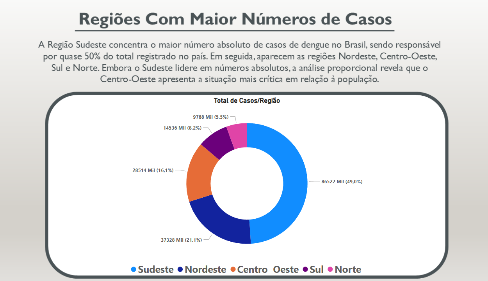
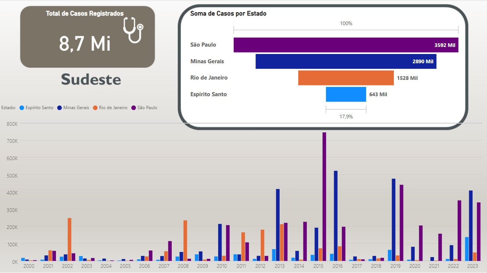

# 🦟 Análise de Dados da Dengue no Brasil (2000–2023)

Este projeto apresenta uma análise visual e exploratória dos casos de dengue registrados no Brasil entre os anos de 2000 e 2023, utilizando Power BI e Excel para demonstrar habilidades em tratamento de dados, criação de dashboards e extração de insights relevantes.

📌 Objetivo
O propósito deste projeto é visualizar os dados públicos de forma clara, acessível e educativa, sem intenção de sugerir políticas públicas ou orientações técnicas de saúde.

🗂️ Dados Utilizados
Fonte oficial: Ministério da Saúde – SINAN / DATASUS

Arquivo: Série histórica de casos prováveis de dengue (2000-2023)

🔍 Principais Análises
Total de casos por região e estado

Evolução anual dos casos (2000 a 2023)

Taxa proporcional por 100 mil habitantes (Censo IBGE 2022)

Comparativo entre números absolutos e incidência relativa

📊 Ferramentas Utilizadas
Power BI (para visualização e dashboard)

Excel (para tratamento de dados, limpeza e estruturação)

💡 Principais Insights
A região Sudeste concentra quase 50% dos casos registrados no país.

Apesar disso, o Centro-Oeste apresenta a maior taxa proporcional: mais de 17 mil casos para cada 100 mil habitantes.

Isso evidencia a necessidade de olhar para os dados além do número absoluto.

📷 Capturas do Painel

Abaixo segue algumas capturas da visualização de dados

⚠️ Aviso
Este projeto tem finalidade educacional e demonstrativa. Não possui vínculo com órgãos de saúde e não representa recomendações ou políticas públicas.
